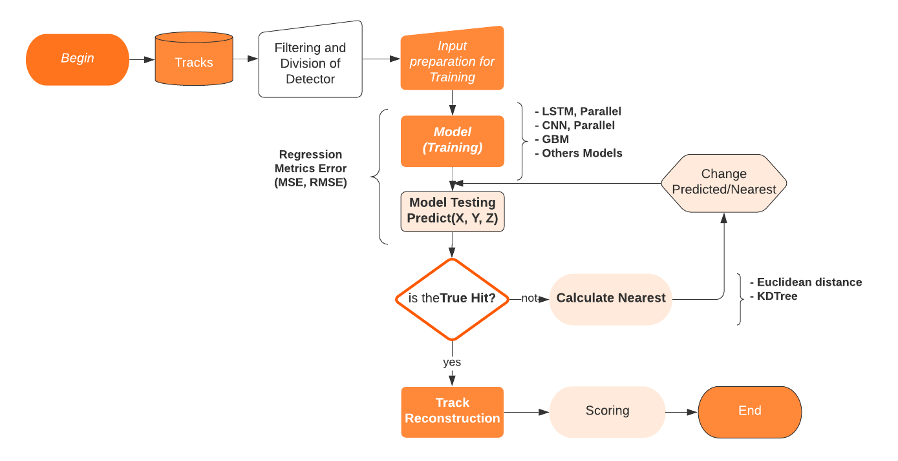
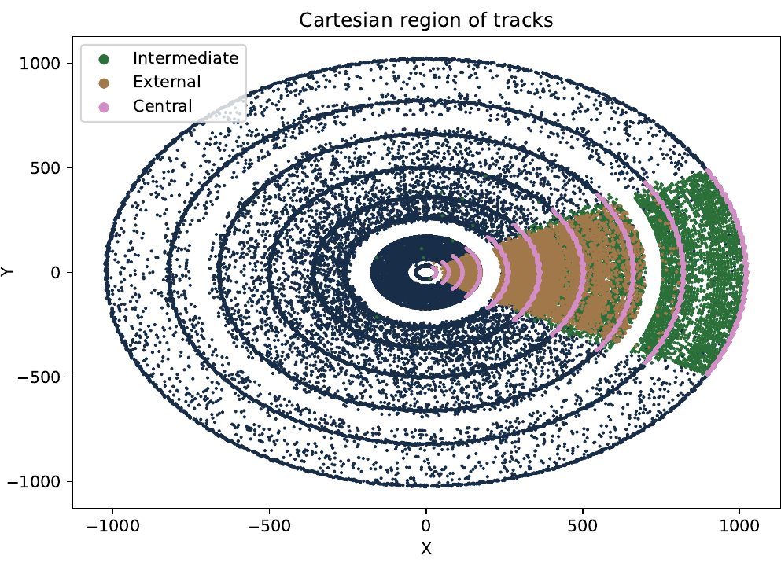
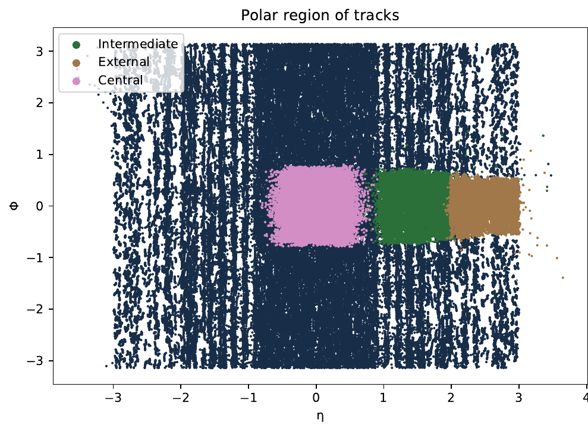
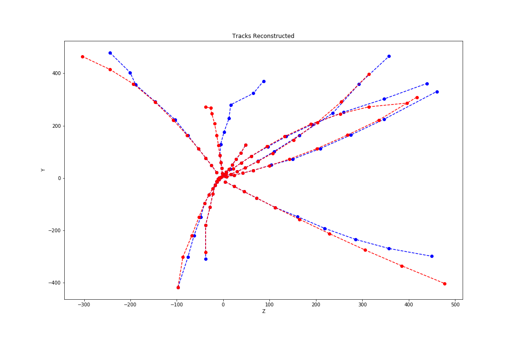
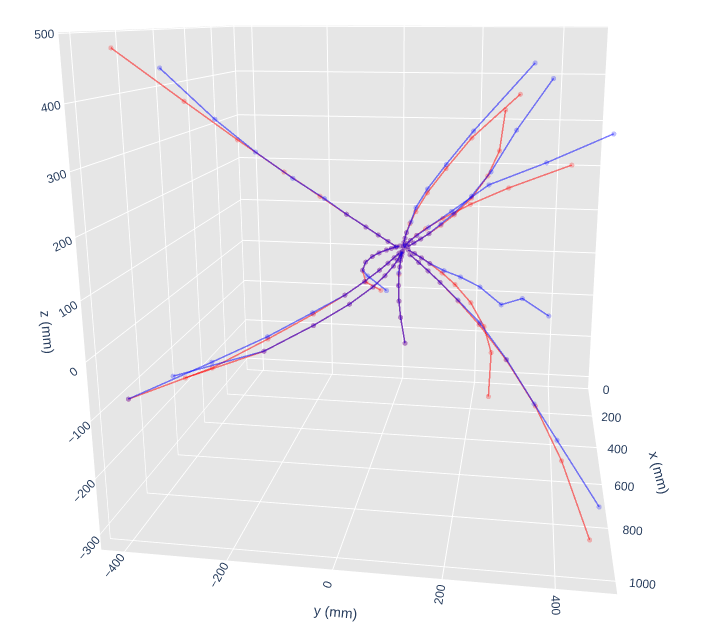
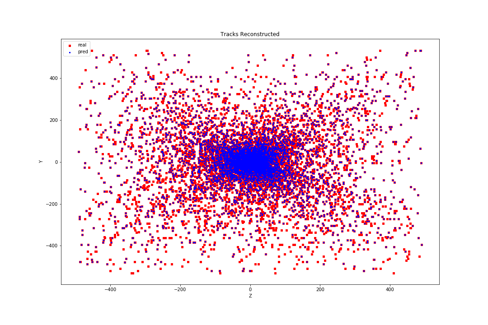

# Track Particle
This project investigate Machine Learning techniques to Particle Track reconstruction problems to HEP, it is part of [SPRACE](https://sprace.org.br/) sponsored by [Serrapilheira](https://serrapilheira.org/). This is a work flow of proposal.



We use different Machine Learning tecnhiques to resolve this big problem in the physics community. If you want to reproduce our results, we have written some general steps. You are welcome, if you have some ideas our suggestations, please let us know.

# Setup
## Environment
You need to install [miniconda](https://docs.conda.io/en/latest/miniconda.html) before on a linux system
1. Configure your conda environtment with env.yml file.
```sh
$ conda env create -f env.yml
$ conda activate trackml
```

## Intallation
To run:
1. Clone the repository
```sh
$ git clone https://github.com/SPRACE/track-ml.git
```
2. go to `track-ml` directory created

you will need to have a GPU or some descent CPU. 


# Dataset
We transformed the detector into three kinematical regions to train our models with different datasets. 
- The first region is formed by the internal barrel with `$\eta$` coordinate from `($-1.0$, $1.0$)`. 
- The second region is the intermediary barrel, (overlap) with `$\eta$` coordinate from `($-2.0$ to $-1.0$)` or `($2.0$ to $1.0$)`. 
- The last region is external with `$\eta$` values between `($-3.0$ to $-2.0$)` or `($3.0$ to $2.0$)`.

Considering the mentioned regions and the symmetry of the detector, each dataset was filtered to contain only high energy particles `pT > 1.0 GeV` with `$\phi$` values between `($-0.5$, $0.5$)`, in order to obtain tracks with larger curvature radius, facilitating initial training. 

<p align="center">
        </img>
        </img>
</p>

A short datasets are in `dataset`  directory. 

# Running
## Training
There are some predefined scripts to train diferents models (MLP, CNN, LSTM, CNN-parallel and others). If you need to change the parameters then change the config_lstm.json file. We use an internal barrel as dataset, this dataset is previously transformed and linked in json file:
```sh
$ python main_train.py --config config_parallel_lstm.json
```
There are other configurations for example a CNN model:

```sh
$ python main_train.py --config config_parallel_cnn.json
```

## Inference

You can inference data test:
```sh
$ python main_inference.py --config config_parallel_lstm.json
```
This will produce a `results/encrypt_name/results-test.txt` file. 


# Performance
## Accuracy of Algorithm
We are using regressions metrics for accuracy of models. We show 2 groups of metrics.

- The principal metrics is a scoring. Scoring counts how many correct hits were found per layer and comparates with original truth hits. Finally we count the quantity of tracks reconstructed.

- The other metrics are regression metrics, we measure the error between real and predicted hits per layer. 

For example, to see the accuracy of training algorithm, go to `results/encrypt_name/results-train.txt` file and the scoring of correct and tracks reconstructed go to `results/encrypt_name/results-test.txt` file. 

Output test file:
```
[Output] Results 
---Parameters--- 
         Model Name    :  lstm
         Dataset       :  phi025-025_eta025-025_train1_lasthit_20200219.csv
         Tracks        :  528
         Model saved   :  /compiled/model-lstm-DCtuvkiXn32hugVsTaokcp-coord-xyz-normalise-true-epochs-21-batch-6.h5
         Test date     :  10/06/2020 12:09:34
         Coordenates   :  xyz
         Model Scaled   :  True
         Model Optimizer :  adam
         Prediction Opt  :  nearest
         Total correct hits per layer  [256. 251. 213. 194. 157. 126.] of 528 tracks tolerance=0.0: 
         Total porcentage correct hits : ['48.48%', '47.54%', '40.34%', '36.74%', '29.73%', '23.86%']
         Reconstructed tracks: 74 of 528 tracks

```
Above output shows scoring per layer for example 48% with 256 hits were matched at the first layer, results are 74 tracks reconstructed of 528 tracks(it is a short dataset just). We also write other info like what kind of coordinate, if we use the nearest optimization, epochs, batchs, optimazer used, model name etc.

Regression metrics per layer are:

```
---Regression Scores--- 
        R_2 statistics        (R2)  = 0.992
        Mean Square Error     (MSE) = 882.525
        Root Mean Square Error(RMSE) = 29.707
        Mean Absolute Error   (MAE) = 9.858

layer  5
---Regression Scores--- 
        R_2 statistics        (R2)  = 1.0
        Mean Square Error     (MSE) = 6.818
        Root Mean Square Error(RMSE) = 2.611
        Mean Absolute Error   (MAE) = 1.325

layer  6
---Regression Scores--- 
        R_2 statistics        (R2)  = 0.999
        Mean Square Error     (MSE) = 27.603
        Root Mean Square Error(RMSE) = 5.254
        Mean Absolute Error   (MAE) = 2.541

layer  7
---Regression Scores--- 
        R_2 statistics        (R2)  = 0.998
        Mean Square Error     (MSE) = 141.074
        Root Mean Square Error(RMSE) = 11.877
        Mean Absolute Error   (MAE) = 5.285
```
The last output shows one geral metric for all hits and four (R^2, MSE, RMSE, MAE) metrics per layer.


## Vizualization
If you want to see the results with plots, go to the plot_prediction.ipynb file at `notebooks` directory.

This plot is 10 tracks reconstructed.
<p align="center">
         </img>
</p>

The next plot shows all hits.
<p align="center">
         </img>
</p>

The next plot is the prediction of all hits.
<p align="center">
         </img>
</p>


