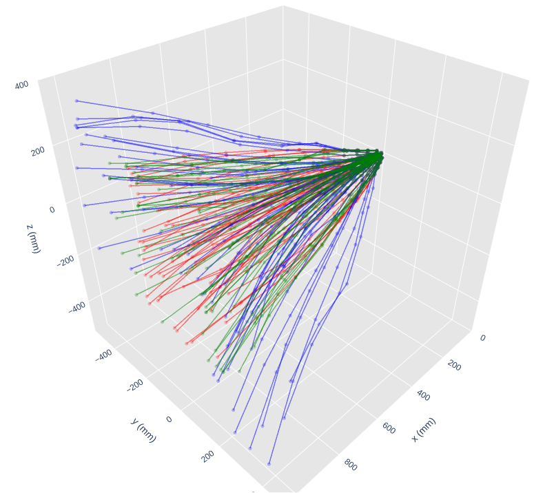

# Track Particle
This project is the first version of Track Particles problem and it is part of [SPRACE](https://sprace.org.br/) sponsored by [Serrapilheira](https://serrapilheira.org/). 
<p align="center">
	 </img>
 </p>

## Run
To run:
1. Clone our repository
2. Configure your conda envirotment with env.yml file
3. There are many scripts to test the problem with diferents models(MLP, CNN, LSTM, RNN and others). For example: ` python main_train.py --config config_lstm.json `. It will create a model with a default LSTM architecture in json file. You can inference the data test with ` main_inference.py --config config_lstm.json `.

## Accuracy of Algorithm
We are using regressions metrics for accuracy of models. We shows 3 kinds of metrics. The first is geral metrics by layer, it measures all real hits and predicted as one line. The second are axes metrics at the current layer and the final is an accounting of correct hits by layer. For example, see this file in `results/encrypt_name/results-train.txt ` 

```
---Regression Scores--- 
        R_2 statistics        (R2)  = 1.0
        Mean Square Error     (MSE) = 8.67
        Root Mean Square Error(RMSE) = 2.945
        Mean Absolute Error   (MAE) = 0.712

layer  5
---Regression Scores--- 
        R_2 statistics        (R2)  = 1.0
        Mean Square Error     (MSE) = 2.339
        Root Mean Square Error(RMSE) = 1.529
        Mean Absolute Error   (MAE) = 0.409

layer  6
---Regression Scores--- 
        R_2 statistics        (R2)  = 1.0
        Mean Square Error     (MSE) = 6.983
        Root Mean Square Error(RMSE) = 2.643
        Mean Absolute Error   (MAE) = 0.606


```

## Vizualization
Open the plot_prediction.ipynb file at notebooks directory to see tracks predicted.